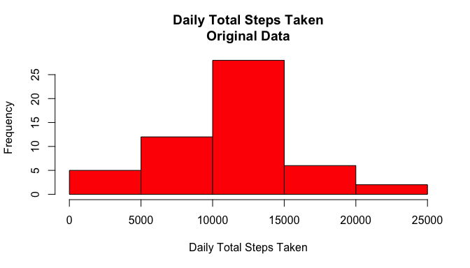
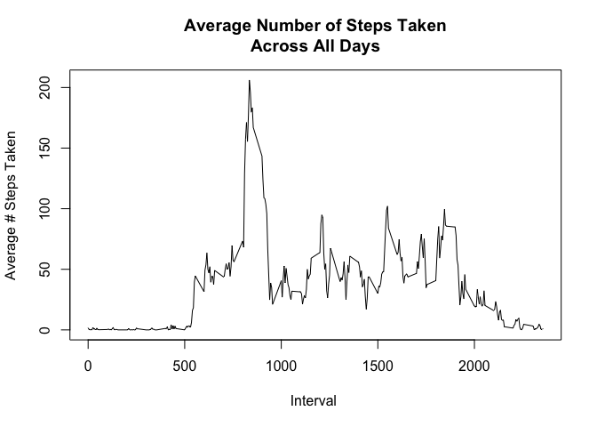
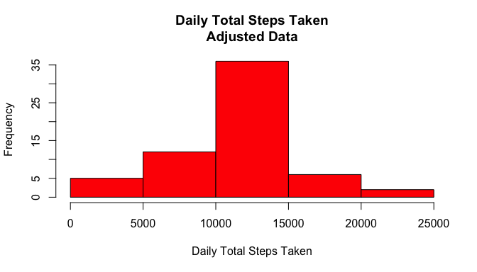
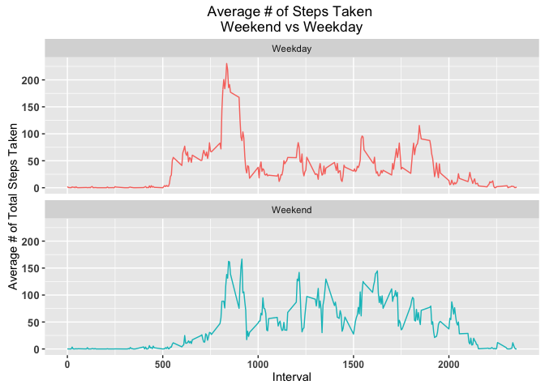

# Reproducible Research: Peer Assessment 1

## Step 1 - Loading and preprocessing the data
Loaded the dplyr and ggplot2 libraries.

```r
library(dplyr)
library(ggplot2)
```
Read in the data(data frame name=orig) and created a new 
variable called dayofweek to use later.

```r
orig<- read.csv("activity.csv",stringsAsFactors = F)
orig$date<-as.Date(orig$date)
orig<-mutate(orig,dayofweek=weekdays(date))
```
## Step 2 - What is mean total number of steps taken per day?
Code to summarize total number of steps taken each day and resulting histogram 
as follows:

```r
o2<-group_by(orig,date) %>% summarize(Dailysum=sum(steps))
hist(o2$Dailysum,col="red",xlab="Daily Total Steps Taken",
     main="Daily Total Steps Taken\nOriginal Data",ylab="Frequency")
```

\

Used summary function to determine mean(10770) and median(10760).
Note the 8 NA's, so these are the mean and median w/o the NA's.

```r
summary(o2$Dailysum)
```

```
##    Min. 1st Qu.  Median    Mean 3rd Qu.    Max.    NA's 
##      41    8841   10760   10770   13290   21190       8
```
## Step 3 - What is the average daily activity pattern?
Grouped by interval and then summarized steps and calculated mean for each
interval. Plot as follows:

```r
o3<-group_by(orig,interval) %>% summarize(Dailymean=mean(steps,na.rm=T))
plot(o3$interval,o3$Dailymean,xlab="Interval ",ylab="Average # Steps Taken",
     main="Average Number of Steps Taken\nAcross All Days",type ="l")
```

\

Used max function to determine interval containing max number of steps taken 
and then subsetting using the daily max. 
Interval with max number of steps=835 and approx 206 steps taken.

```r
Dailymax<-max(o3$Dailymean)
o3[o3$Dailymean==Dailymax,]
```

```
## Source: local data frame [1 x 2]
## 
##   interval Dailymean
##      (int)     (dbl)
## 1      835  206.1698
```
## Step 4 - Imputing missing values
First looked at where are there missing values. All NA's are in steps as 
shown below:

```r
colSums(is.na(orig))
```

```
##     steps      date  interval dayofweek 
##      2304         0         0         0
```
Based on plot from step 3, there is a definate pattern as to steps 
taken vs. interval.
Based on this pattern decided to replace NA's for steps for a given interval
with the mean steps taken for that interval. Merged orig df and df with interval
mean steps taken. Created index of rows where steps are NA's and used that index
to replaced NA's in orig df with interval mean. Name of new data frame=rev.

```r
o5<-merge(orig,o3)
nainx<-is.na(o5$steps)
o5[nainx,2] <-o5[nainx,5]
rev<-o5
```
Recalculated total number of steps taken each based on rev data frame and 
histogram as follows:

```r
r2<-group_by(rev,date) %>% summarize(Dailysum=sum(steps))
hist(r2$Dailysum,col="red",xlab="Daily Total Steps Taken",
     main="Daily Total Steps Taken\nAdjusted Data",ylab="Frequency")
```

\

Used summary function to determine mean(10770) and median(10770) of revised data 
frame. Replacing NA's maintained the mean as expected since the NA's were for 8 
complete days and the daily sum for the average intervals used to populate the
NA's was 10766. The median did adjust slightly from 10760 to 10770.

```r
summary(r2$Dailysum)
```

```
##    Min. 1st Qu.  Median    Mean 3rd Qu.    Max. 
##      41    9819   10770   10770   12810   21190
```
## Step 5 - Are there differences in activity patterns between weekdays and weekends?
Created a factor variable called dow and applied to rev df. Then grouped by 
dow factor variable and summarized by interval and calculated interval means.

```r
dow=as.factor(1*(rev$dayofweek=="Saturday")| 1* (rev$dayofweek=="Sunday"))
levels(dow)=c("Weekday","Weekend")    
r3<-mutate(rev,dow)
r3<-group_by(r3,dow,interval) %>% summarize(Dailymean=mean(steps,na.rm=T))
```
Used ggplot to plot line graphs for weekday vs weekend. There are differences 
in patterns. The weekday pattern starts earlier(walking to work/bus or train
stop? or early morning walk before work) and then drops off. The weekend pattern
is "flatter" possibly reflecting walking throughout the day doing errands.

```r
g<-ggplot(r3,aes(interval,Dailymean,color=dow))
                 g + geom_line() + 
                 facet_wrap( ~ dow,nrow=2,ncol=1) + 
                 labs(y="Average # of Total Steps Taken") + 
                 labs(x="Interval") + 
                 labs(title="Average # of Steps Taken \nWeekend vs Weekday") +
                 theme(axis.text.y=element_text(size=10,face="bold")) +
                 theme(axis.text.x=element_text(size=9,face="bold"))  +
                 theme(legend.position="none")
```

\
